

# PeakBotMRM help
for version 0.9.25

## Overview
PeakBotMRM is a software for the automated processing of targeted LC-MRM-MS datasets with the aim of absolute quantification. It is inspired by machine learning applications that use Convolutional Neural Network (CNN) for this task. 

## Installation

1. Download ProteoWizard [https://proteowizard-teamcity-artifacts.s3.us-west-2.amazonaws.com/ProteoWizard/bt83/1898651/pwiz-setup-3.0.22198.0867718-x86_64.msi](https://proteowizard-teamcity-artifacts.s3.us-west-2.amazonaws.com/ProteoWizard/bt83/1898651/pwiz-setup-3.0.22198.0867718-x86_64.msi) and install it (preferably as an administrator if you are asked during the installation process).

2. Copy the 7zip archive PeakBotMRM_v0.9.25.7z from XXX to your PC and unzip the archive to any folder (e.g. C:/). 

3. Double click ont the runPeakBotMRM.bat file in << Your Folder >>/PeakBotMRM/v0.9.25/

## Use

PeakBotMRM has two modes of operation, namely the Training and the Prediction modes. 

The Training mode is designed to train a new CNN for the task of predicting whether an EIC contains a chromatographic peak approximately in its center. This mode is for advanced users and needs to be carried out when a new LC-MS setup or a different analytical method (chromatography, MS-method, etc.) are setup that are significantly different from previously available methods. The training of a new model requires a manually curated datasets of thousands of different EIC profiles in order to generalize well for new EIC instances. 

The Prediction mode is for processing new experiments with an established model for a particular LC-MS setup. It utilizes a trained model (see mode Training) and predicts chromatographic peaks, noise or background abundances in EICs. This mode is for routine use and LC-MS users to process their datasets quickly and with a high accuracy. Other than the first mode, here only a list of target compounds and the raw LC-MS data is required. PeakBotMRM and the used model then try to predict the EICs and their chromatographic peaks. This mode also provides a graphical user interface (GUI) to the user to quickly review the generated results, carry out absolute quantification, and export of the processing results. 

## Training mode

Currently the training mode is restricted to experienced users and will be provided with a GUI in a later iteration of the software. We apologize for this inconvenience. 

## Prediction mode

### Start the GUI
Double-click on the runPeakBotMRM.bat in the folder TODO. The GUI will appear in a couple of seconds. 

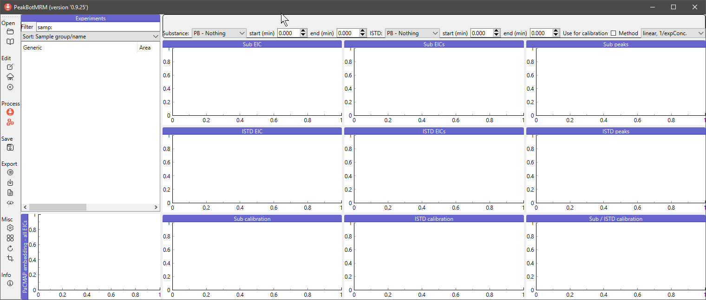

Note: Copy the runPeakBotMRM.bat file to the directory where the LC-MS raw data is located. If this copied runPeakBotMRM.bat file is then double-clicked, the working directory will be the folder with the raw data and, if available, the previously saved experiment will automatically be loaded. Additionally, the PeakBotMRM application can be started faster for a particular experiment. 

### Load raw LC-MS data
This step loads raw LC-MS data into PeakBotMRM. Click on the open symbol to load a new experiment. 

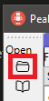

A dialog will appear. 

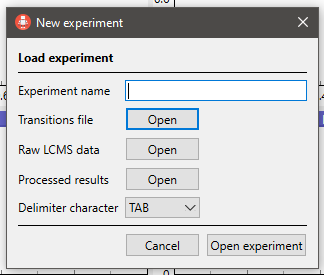

The following information has to be provided in this dialog: 
* Experiment name: The name of the experiment. It is recommended to use a short, yet descriptive name and include some sort of ID. Underscores should be used instead of spaces or tabs. 
* Transition file: The transition file specifying the target compounds to be detected. A template is provided [here](./transitions.tsv).
* Raw LCMS data: The folder of where the raw LC-MS data is saved. 
* Processed results: Optional
* Delimiter character: The character used for separating the cells in the transition file. Tabulator is the default character and also used in the above example transition file. 

Once all information has been provided, click 'Open experiment' in the dialog to start the import process. 

#### Automated step: file conversion

When new raw LC-MS data is loaded, it is first converted into the mzXML format with the msConvert tool of ProteoWizard. This step is fully integrated into PeakBotMRM. It can take a couple of minutes for the conversion to finish. Reopening an already converted experiment is much faster. 

## Load a previously processed experiment

A previously saved experiment can be loaded via the second open button in the menu on the left side. It and all associated settings will be resored into the current workspace. 

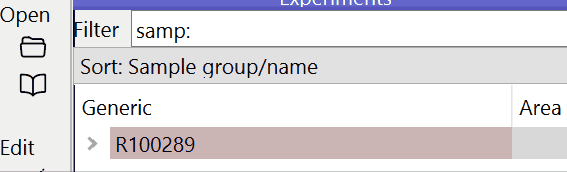

## Set meta-data for files

It is important to specify some meta-information for the samples. This includes whether a sample is a technical necessity or a biological samples. To start the meta-data annotation, click on the Edit button in the menu on the left side. A dialog will open showing a table. 

Some columns necessary will be provided per default. Please fill as many as possible with the respective meta-data of the samples (if applicable). To edit a cell, double-click on it and edit its contents. To copy the values of one cell to its bottom cells (similar to Excel), select the first cell and the bottom cells. Then click on the button 'Fill with first cells' to copy the information of the first cell to its bottom cells. To clear the contents of several cells at once, select the cells and then click on 'Rest selected cells'. 

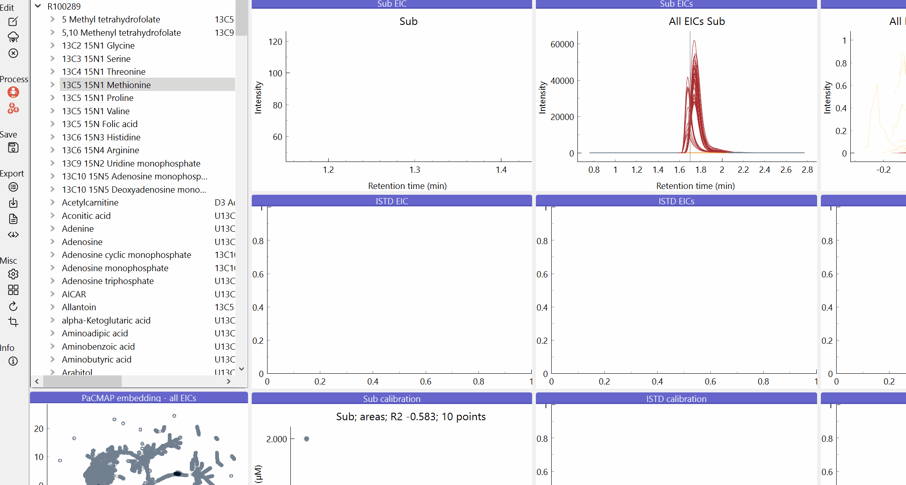
  
| Column name | Description |
|---|---|
| File name | The name of the sample. Do not change. |
| Inj. volume | Volume injected by the LC-MS instrument. This information is fetched from the raw LC-MS data if available. Note: Previous sampling volumes are not accounted for.|
| Dilution | The dilution level by the LC-MS instrument. This information is fetched from the raw LC-MS data if available. Note: Previous dilution steps are not accounted for. |
| Comment | An arbitrary comment. |
| Group | Sample group to assign this sample to. Can be anything, but needs to be the same for all samples of the same group. 
| Type | Sample type. This should be 'Bio' for biological samples or 'Tech' for technical samples such as blanks, calibration samples, or QC samples. |
| Sample ID | The external sample IDs. |
| Report type | TODO |
| Tissue type | The tissue type this sample has been generated from (if applicable). |
| Tissue weight | The weight of the tissue used for generating this sample. Attention: needs to be the same unit for all samples. |
| Cell count | The cell count of the sample (if applicable). |
| Sample volume | The volume of the aqueous sample (if applicable). |
| Report description | TODO |
| Report calculation | Additional caluculations after regression. |

The field 'Report calculation' is of utmost importance for correct absolute quantification. Any dilution step, cell count calculation, etc. must be implemented there taking the variable 'val' into consideration. Here 'val' represents the regression calculation of the peak area and the calcualted regression curve. Input values can be:
* val ## calibration value as determined by the peak area and regression curve is reported
* val * 0.2 ## A dilution of the factor 1:4 is taken into consideration
* val * 0.1 * 40000000 / 1000000 ## A diluation of the factor 1:9 is taken into consideration and a normalization from 40E6 cells in the sample to 1E6 cells is calculated. 
* val / 17.5 ## The tissue weight of the particular sample was 17.5 µg. 
* 6 ## incorrect, as regardless of the regression quantification 6 will be reported any time. 

This calcualted new value will be reported in the report export of the experiment. 

Note: The field 'Report calculation' is the most generic form for any post-regression calculations. Thus, it needs to be individually for each sample (for sample-specific information such as tissue weight, cell count or sample volume) and sample preparartion step (for steps with the same numbers). Note: In future versions of the GUI it will be possible to access other meta-data information fields, however, currently this is not supported. 

### Process dataset with a PeakBotMRM model

To predict if the EICs of an experiment contain chromatographic peaks, first select an experiment by clicking on its name in the experiment list. Then click on the PeakBotMRM button in the menu on the left side of the window. 

A small pop-up will appear showing a list of default models and the option to load other models. Click on a default model's name or select to option to load another model. When loading another model is selected, a file dialog will appear. Select the model to be used there. A dialog will ask if this model should be added to the list of default models. If yes is selected, the model will be copied and next time appear in the list of default models when a new dataset is to be processed. 

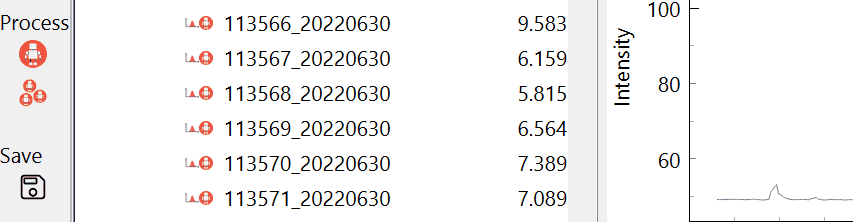

After selecting a model, all raw LC-MS data will be loaded and processed with the selected PeakBotMRM model. This step typically only needs a couple of seconds to finish and a progress dialog will be shown. After completion of the prediction, a summary can be generated in the form of an HTML file. 

Additionally, after a dataset has been processed, the results will be added to the experiment. 

### Navigate results

Once the raw data has been loaded, the experiment will be shown on in the 'Experiments' section on the left side. The name of the experiment will be shown on the top level. To expand an experiment, click on the arrow on the left side of its name. A list of the substances defined in the used transition list will be shown. Each substance can be further expanded again with the arrow on the left side of the substance's name revealing the loaded samples. 

Clicking on any item in a list will load some data. 
* Click on an experiment: This will load the data and visualize all EICs in the PaCMAP illustration. No EICs will be shown.
* Click on a substance: This will load the substance and illustrate all EICs in the different samples.
* Click on a file: This will load the substance and illustrate allEICs in the different samples and the currently selected sample as a single EIC. 

Note: It is not possible to select several substances at once, but several samples of a substance in the same experiment can be selected. Use the Ctrl and/or shift key to select several samples at once. 

In the following figure the sample 'CAL8_20220628' with the substance '13C5 15N1 Proline' of the experiment 'R100289' is loaded. The plot 'Sub EIC' shows the EIC in the sample 'CAL8_20220628' while the plot 'Sub EICs' shows all EICs of the subtance in the experiment overlaid. 

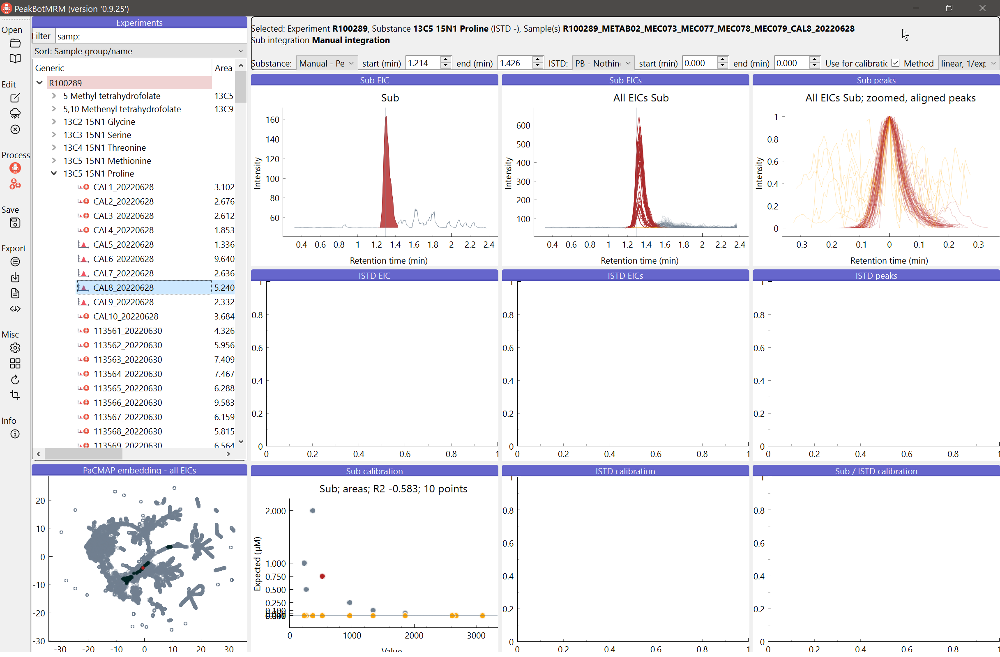

#### Zoom into EICs

The plot to illustrate several chromatographic peaks at once is handy to quickly review several samples at once. However, the more peaks are depicted at the same time, the more crowded the area is. To zoom into certain areas of the plot use the mouse. 

To simply move the plot area, click and hold the left mouse button and move the mouse into the desired direction. The plot will update instantaneously. 

To zoom in or out of the plot, click and hold the right mouse button and move the mouse into the desired direction. Movement up and right will zoom into, while movement to the left and bottom will zoom out of the area. The point where the right click is performed is crucial since this will be used as the anchor durint the zoom operation. 

To reset the default zoom, click the little icon that appears in the left bottom corner. A switch to a different substance will automatically reset the zoom on any plot. 

The following gif shows the move and zoom feature in action. A red circle means that the right mouse button has been clicked and held, while a yellow circle indicates that the left mouse button has been clicked and held. 

#### Result types
Three different types of results are available in PeakBotMRM. These are:
* Nothing: Neither a chromatographic peak nor a noise area have been detected by PeakBotMRM or the user.
* Peak: A chromatographic peak has been detected by the used PeakBotMRM model or the user. 
* Noise: No chromatographic peak has been detected, but enough information is available to esitmate an approximate location of the chromatographic peak and integrate the noise area there. 

These three types are either predicted by the used PeakBotMRM model or manually curated by the user. Both types has a prefix that will be shown before the type with either 'PB' for the prediction with the used model or 'Manual' for user curated results. 

Thehe integration type of a particular EIC (only if a single sample is selected) will be shown in the info-box on the top of the window. Moreover, an icon on the left side of the sample name also indicates the type or integration. 

| Icon | Description | Info-box string |
|---|---|---|
|  | Nothing has been detected with the used PeakBotMRM model in an automated fashion. | PB - Nothing |
|  | A chromatographic peak has been detected with the used PeakBotMRM model in an automated fashion. | PB - Peak |
|  | No chromatographic peak has been detected with the used PeakBotMRM model in an automated fashion and noise has been integrated as a substitute. | PB - Noise |
|  | Nothing has been curated by the user. | Manual - Nothing
| 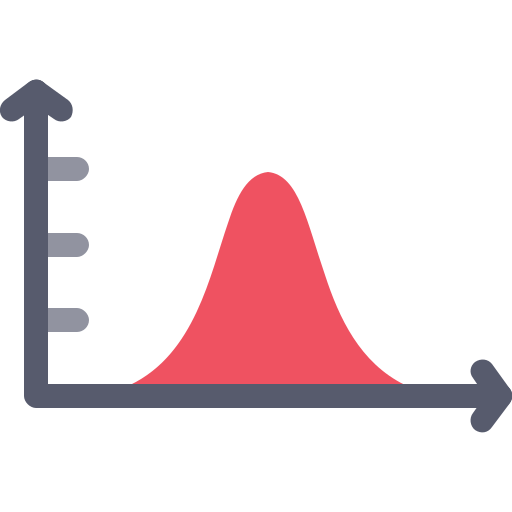 | A chromatographic peak has been curated by the user. | Manual - Peak |
|  | Noise has been curated by the user. | Manual - Noise |

Note: Chromatographic peaks will be illustrated with the HighlightColor 1 (default red) and noise areas will be illustrated with the HighlightColor 2 (default orange). Both can be changed in the settings dialog. Any area of an EIC that is not part of a chromagraphic peak or a noise area will be shown in the NormalColor (default grey). 

#### Change result types or integration area. 

Caution: Changing any of the result types or their associated information cannot be undone! Use with caution. 

The user can at any time change the prediciton or manual integration via the controls in the info-box on top of the EIC depictions. For both the substance and the respective internal standard the user can change their attributes quickly there. 

The results type can be selected via the combobox next to 'Substance' and 'ISTD'. It specifies whether the EIC contains a chromatographic peak, a noise area or nothing. Futhermore, for chromatographic peaks and noise areas the start and end retention times can also be specified there. 

Note: If several samples are selected at once, the results type and end/start retention times of all these will update simultaneously. 

Note: Once the user has changed any of these attributes the integration types always stays with 'Manual'. 

Additionally to changing a results type via the info-box, the user can also use the keyboard to change this. The following table provides information about this shortcuts. 

| Key | Action |
|---|---|
| Actions for the substance | 
| q | Change the results type of the substance. This will cycle through 'Manual - nothing', 'Manual - peak', and 'Manual - noise' |
| w | Extend the start of the chromatographic peak or noise area towards an earlier retention time |
| e | Reduce the start of the chromatographic peak or noise area towards a later retention time | 
| r | Reduce the end of the chromatographic peak or noise area towards an earlier retention time |
| t | Extend the end of the chromatographic peak or noise area towards a later retention time |
| Actions for the internal standard | Note: This shortcuts require the shift key to be pressed.  |
| A | Change the results type of the substance. This will cycle through 'Manual - nothing', 'Manual - peak', and 'Manual - noise' |
| S | Extend the start of the chromatographic peak or noise area towards an earlier retention time |
| D | Reduce the start of the chromatographic peak or noise area towards a later retention time | 
| F | Reduce the end of the chromatographic peak or noise area towards an earlier retention time |
| G | Extend the end of the chromatographic peak or noise area towards a later retention time |

#### Change calibration curve options

The user can change the calibration curve options at any time for a substance. Per default all calibration levels that have a detected chromatographic peak and that should be used for the calibration of a particular substance are used. Noise areas are not used for calibration curves at all. 

Additionally, the user has the option to remove certain calibration levels on a per-substance base. This is done via deactivating the 'Use for calibration' checkbox in the info-box of a particular substance and sample. The respective calibration level will no longer be used, but still be illustrated in the regression plot. 

### Save results

At any time the results can be saved to a binary file that can at a later time be loaded into PeakBotMRM again. 

To save an experiment, click on its name and then select the save icon in the menu on the left side. Select the folder to which the experiment shall be saved to. The file-name will be the name of the experimnt. 

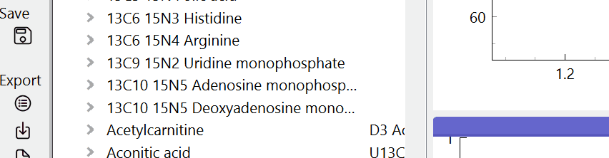

### Export results

Processing and manual curation results can be exported to a comprehensive tsv file (global overview of the processing including meta-information about the detected peaks and noise areas) as well as a concise report including only the biological samples and their normalized values. To export either the results or the report, click the Export buttons in the menu on the left side. 

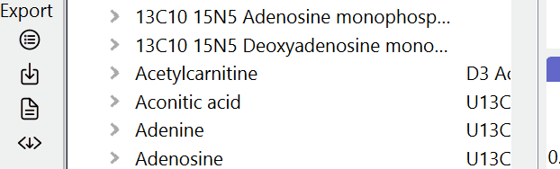

### Settings

To change common settings such as file-name replacements, colors, export options, and others, click on the settings button in the menu on the left side. A dialog will open. Modify the contents of the desired field(s) and accept the settings. To save the settings on a permanent basis, click on 'Accept and save as default'. 

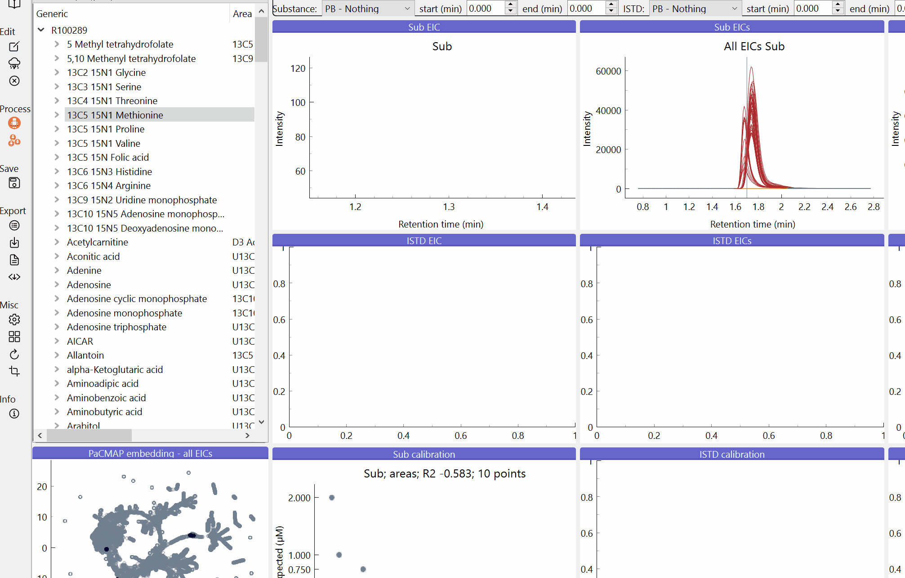

## Contact

If you have any questions or problems with the application, please contact the main developers. 

## Credits

<b>PeakBotMRM team</b>

[Metabolomics Facility of the Molecular Discovery Platform] (https://cemm.at/research/facilities/molecular-discovery-platform/metabolomics-facility) 
CeMM  Forschungszentrum für Molekulare Medizin GmbH 
der Österreichischen Akademie der Wissenschaften 
Lazarettgasse 14, AKH BT 25.3 
1090 Wien 
Austria 

## Licence

Copyright (c) 2022 PeakBotMRM team

Permission is hereby granted, free of charge, to any person obtaining a copy of this software and associated documentation files (the “Software”), to deal in the Software without restriction, including without limitation the rights to use, copy, modify, merge, publish, distribute, sublicense, and/or sell copies of the Software, and to permit persons to whom the Software is furnished to do so, subject to the following conditions:

The above copyright notice and this permission notice shall be included in all copies or substantial portions of the Software.

THE SOFTWARE IS PROVIDED “AS IS”, WITHOUT WARRANTY OF ANY KIND, EXPRESS OR IMPLIED, INCLUDING BUT NOT LIMITED TO THE WARRANTIES OF MERCHANTABILITY, FITNESS FOR A PARTICULAR PURPOSE AND NONINFRINGEMENT. IN NO EVENT SHALL THE AUTHORS OR COPYRIGHT HOLDERS BE LIABLE FOR ANY CLAIM, DAMAGES OR OTHER LIABILITY, WHETHER IN AN ACTION OF CONTRACT, TORT OR OTHERWISE, ARISING FROM, OUT OF OR IN CONNECTION WITH THE SOFTWARE OR THE USE OR OTHER DEALINGS IN THE SOFTWARE. 

   